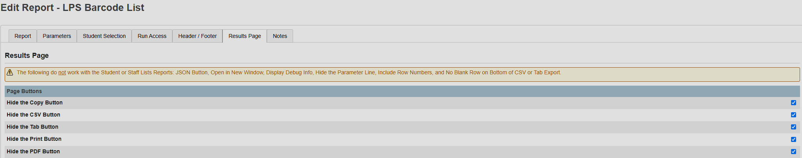
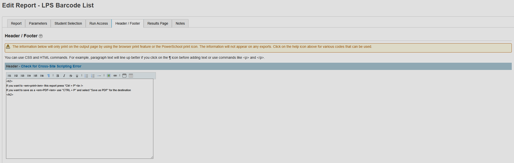
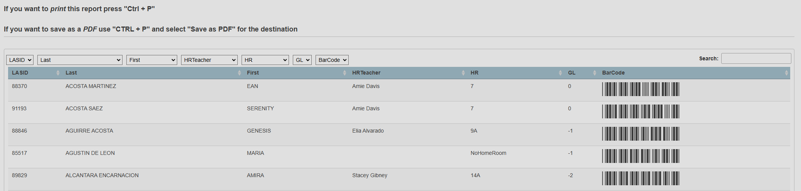
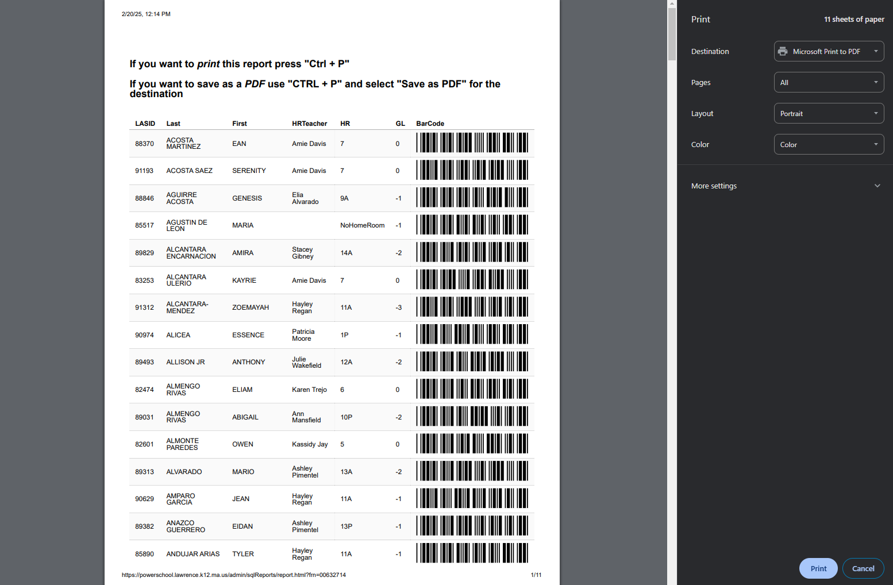

# LPS-SQL-Barcode

### Same Process for "Current Selection Report"

To ensure the barcode font is preserved, the Copy, CSV, Tab, Print, and PDF buttons have been disabled as they only extract the HTML data, leaving behind the CSS.

The following commands have been added to the header to guide users on how to print and save as PDF:

### Finished Result

Here is the final output:

To print or save as PDF, users can utilize the browser's print function:

